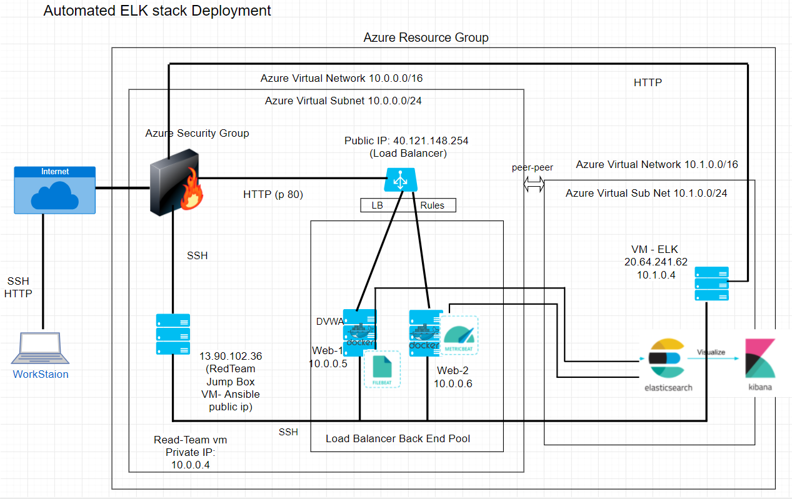

## Automated ELK Stack Deployment

The files in this repository were used to configure the network depicted below.



These files have been tested and used to generate a live ELK deployment on Azure. They can be used to either recreate the entire deployment pictured above. Alternatively, select portions of the yml file may be used to install only certain pieces of it, such as Filebeat.

This document contains the following details:
- Description of the Topology
- Access Policies
- ELK Configuration
  - Beats in Use
  - Machines Being Monitored
- How to Use the Ansible Build

To test the filebeat and metricbeat setp up the following three tests have been run on the system:
1. Generate a high amount of failed SSH login attempts and verify that Kibana is picking up this activity.
2. Generate a high amount of CPU usage on the pen-testing machines and verify that Kibana picks up this data.
3. Generate a high amount of web requests to your pen-testing servers and make sure that Kibana is picking them up.

The linux code required for the tests is in the Linux directory and the snapshots of the results are in the images folder.

### Description of the Topology

The main purpose of this network is to expose a load-balanced and monitored instance of DVWA, the D*mn Vulnerable Web Application.

Load balancing ensures that the application will be highly available and responsive, in addition to restricting access to the network. Although in our case, we had our servers in a single geographical area, in practice this might not be always possible. Load balancers prevent latency and do not degrade the user experience. Latency can prove costly, resulting in lost customers, missed revenue, and reputational damage.

Load balancers protect the following aspect of security:
Load Balancing plays an important security role. The off-loading function of a load balancer defends an organization against distributed denial-of-service (DDoS) attacks by shifting attack traffic from the corporate server to a public cloud provider. DDoS attacks represent a large portion of cybercrime as their number and size continues to rise. Hardware defense, such as a perimeter firewall, can be costly and require significant maintenance. Software load balancers with cloud offload provide efficient and cost-effective protection.

Although in the project we did not implement automatic SSL encryption and decryption at the load balancer. Secure Sockets Layer (SSL) is the standard security technology for establishing an encrypted link between a web server and a browser. SSL traffic is often decrypted at the load balancer. When a load balancer decrypts traffic before passing the request on, it is called SSL termination. The load balancer saves the web servers from having to expend the extra CPU cycles required for decryption. This improves application performance.
 
Listed are the advantage of a jump box?_
Secure Sockets Layer (SSL) is the standard security technology for establishing an encrypted link between a web server and a browser. SSL traffic is often decrypted at the load balancer. When a load balancer decrypts traffic before passing the request on, it is called SSL termination. The load balancer saves the web servers from having to expend the extra CPU cycles required for decryption. This improves application performance.

Integrating an ELK server allows users to easily monitor the vulnerable VMs for changes to the data and system logs.

Filebeat monitors the log files or locations that you specify, collects log events, and forwards them either to Elasticsearch or Logstash for indexing.

Metricbeat is a lightweight shipper that you can install on your servers to periodically collect metrics from the operating system and from services running on the server. Metricbeat takes the metrics and statistics that it collects and ships them to the output that you specify, such as Elasticsearch or Logstash.

Filebeat and Metribeat are part of the Beats platform. Beats are open source data shippers that you install as agents on your servers to send operational data to Elasticsearch. Elastic provides Beats for capturing various categories of data. The full list is given here https://www.elastic.co/guide/en/beats/libbeat/7.12/beats-reference.html. 

The configuration details of each machine may be found below.

| Name          | Function                    | IP Address              | Operating SYstem |
|---------------|-----------------------------|-------------------------|------------------|
| Jumpbox       | Gateway                     | 13.90.102.36 (10.0.0.4) | Linux            |
| Web-1         | Web Server                  | 10.0.0.5                | Linux            |
| Web-2         | Web Server                  | 10.0.0.6                | Linux            |
| ELK-Server    | log Web Data                | 20.64.241.62 (10.1.0.4) | Linux            |
| Load Balancer | Controls Web Server Access  | 40.121.148.254          | na               |

### Access Policies

The machines on the internal network are not exposed to the public Internet. 

Only the elk machine can accept connections from the Internet. Access to this machine is only allowed from the following IP addresses: http://20.64.241.62:5601/app/kibana

Although Web-1 and Web-2 machines can be accessed from the internet via http://40.121.148.254/setup.php this is not a direct access but via the load balancer as detailed above.

Machines within the network can only be accessed by machine on the same VNet and machines on other VNets which have a peer-to-peer VNet connections.

The jumpbox machine with a private ip of 10.0.0.4 was allowed access to the ELK VM 

A summary of the access policies in place can be found in the table below.

| Name          | Publicly Accessible | Allowed IP address              |
|---------------|---------------------|---------------------------------|
| Jumpbox       | Yes                 | Only Home IP via ssh public key |
| Web-1         | No                  | 10.0.0.4                        |
| Web-2         | Yes                 | 10.0.0.4                        |
| ELK-Server    | Yes                 | Home IP                         |
| Load Balancer | Yes                 | Any                             |


### Elk Configuration

Ansible was used to automate configuration of the ELK machine. No configuration was performed manually, which is advantageous because...
- _TODO: What is the main advantage of automating configuration with Ansible?_
Ansible can automate IT environments whether they are hosted on traditional bare metal servers, virtualization platforms, or in the cloud. It can also automate the configuration of a wide range of systems and devices such as databases, storage devices, networks, firewalls, and many others.


The playbook implements the following tasks:
- _TODO: In 3-5 bullets, explain the steps of the ELK installation play. E.g., install Docker; download image; etc._
- Install docker.io
- install python3
- Install Docker Module
- Assign appropriate memory
- Download and launch docker elk container
- enable service docker on boot

The following screenshot displays the result of running `docker ps` after successfully configuring the ELK instance.

**Note**: The following image link needs to be updated. Replace `docker_ps_output.png` with the name of your screenshot image file.  


### Target Machines & Beats
This ELK server is configured to monitor the following machines: 
Web-1 and Web-2 are being monitored with private IP addresses 10.0.0.5 and 10.0.0.6 via the peer-to-peer networking.

We have installed the following Beats on these machines: Filebeats and Metricbeats have been successfully installed

These Beats allow us to collect the following information from each machine:

Filebeat: (reference: https://www.elastic.co/guide/en/beats/filebeat/current/filebeat-overview.html )
Filebeat is a lightweight shipper for forwarding and centralizing log data. Installed as an agent on your servers, Filebeat monitors the log files or locations that you specify, collects log events, and forwards them either to Elasticsearch or Logstash for indexing.

Metricbeat: (reference: https://www.elastic.co/guide/en/beats/metricbeat/current/metricbeat-overview.html )
Metricbeat is a lightweight shipper that you can install on your servers to periodically collect metrics from the operating system and from services running on the server. Metricbeat takes the metrics and statistics that it collects and ships them to the output that you specify, such as Elasticsearch or Logstash.

### Using the Playbook
In order to use the playbook, you will need to have an Ansible control node already configured. Assuming you have such a control node provisioned: 

SSH into the control node and follow the steps below:
- Copy the configuration file to ansible docker container.
- Update the configuration file to include IP of ELK VM and the port number 5601 and 9200.
- Run the playbook, and navigate to web browser to check that the installation worked as expected.

The folders containing the required files are organized in the Ansible machine as follows:

```
etc # should already exist.
----> ansible # 
---------> ansible.cfg  
---------> hosts # 
---------> roles # this is a new directory that will contain our ansible playbooks.
--------------> files # this is a new directory that will contain the configuration files.
```
---

Which The hosts file is updated to make Ansible run the playbook on a specific machine 
The host field in the playbook.yml files specfies the group of machines to run the playbook on. The private IPs of the machines are listed in the hosts files under groups. Each ip can belong to multiple groups.  You update the configuration file

To specify which machine to install the ELK server on: we specify host: elk in the install-elk.yml file and include the private ip of the elk server in the hosts file under [elk]

To install filebeat on: We specify host: webservers in the filebeat-playbook file. The ip of the web-1 and web-2 is included under [webservers] in the hosts file.

In order to check that the ELK server is running we navigate to the URL given below: 
Ip_address_of_ELK_VM(20.64.241.62):5601/app/kibana

The specific commands that are needed to run to download the playbook, updatethe files etc are given in the Linux folder in the cmd-download-playbook-etc file. 

